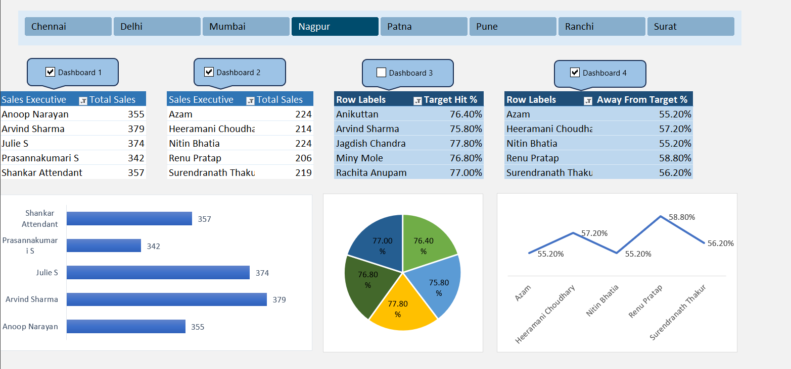

# 📊 Sales Performance Dashboard in Excel

## 🎯 Project Overview
This project showcases an **interactive Sales Performance Dashboard** built in **Microsoft Excel** using real-world-style sales data.  
The goal was to **analyze and visualize sales performance** across multiple cities and sales executives, providing actionable business insights through interactive dashboards.

---

## 🧰 Tools & Skills Used
- **Microsoft Excel **  
  - Pivot Tables & Pivot Charts  
  - Slicers for dynamic filtering  
  - Conditional formatting  
  - Interactive buttons & dashboards  
- **Data Cleaning & Preparation**
- **Data Visualization & Storytelling**

---

## 📈 Project Insights
- Compared **total sales** and **target achievements** across cities such as Chennai, Nagpur, and more.  
- Identified top-performing sales executives and those **below target**.  
- Designed **four dashboards** displaying:
  - Total Sales by Executive  
  - Target Hit %  
  - Away from Target %  
  - Visual insights (bar, pie, and line charts)

---

## 💡 Key Learnings
- How to structure and automate dashboards using Excel macros (`.xlsm` format)
- Importance of interactive visuals in communicating insights

---

## 🖼️ Preview

---

## 🚀 How to Use
1. Download the Excel file: `Sales Data.xlsm`
2. Enable macros when opening the file.
3. Use the **buttons and slicers** to switch between dashboards and explore the data.

---

⭐ *If you found this helpful, consider giving it a star on GitHub!*
